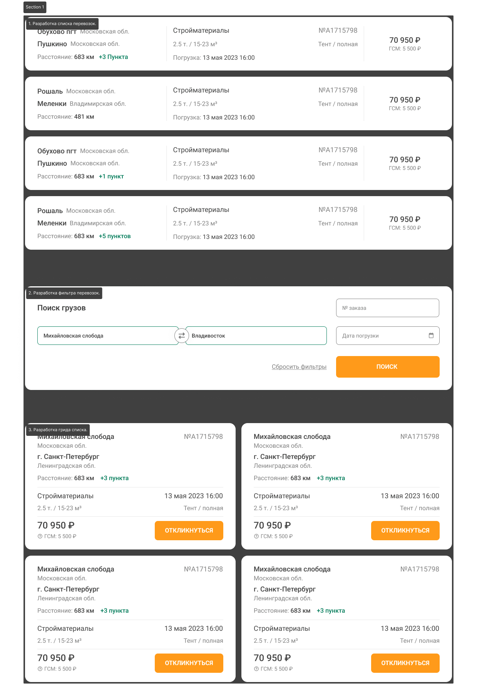

# Freight Aggregator


## Описание
Данные репозиторий явялется решением тестового задания компании "**ITECO**" на позицию Frontend-разработчика.



## Техническое задание  ITECO

Разработать веб-приложение по поиску заказов для перевозок транспортной компании. При разработке придется использовать мок-данные (faker-js, firebase database, …на ваше усмотрение).

При разработке использовать следующие технологии: ReactJS/NextJS, Redux Toolkit, TanStack Query, Axios, Styled Components, Ant Design, Formik, Yup


Реализовать по макету [**макету из figma**](https://www.figma.com/file/MXpAPpp1Wtiq6yuSn2ZeH7/%D0%A2%D0%B5%D1%81%D1%82%D0%BE%D0%B2%D0%BE%D0%B5-%D0%B7%D0%B0%D0%B4%D0%B0%D0%BD%D0%B8%D0%B5-ITECO-(Copy)?type=design&node-id=0-1&mode=design&t=yg0iHb3yU0KITYgm-0), после разместить на любом удобном сервисе (GitHub pages, Firebase, Firebase Hosting, Vercel…).

Для разработки не обязательно использовать настоящие запросы, мы можем эмулировать ответ через faker-js, но они должны быть обернуты в TanStack Query.

Тестовое задание разделено на 3 уровня сложности (по порядку возрастания):

1. **Разработка списка перевозок.**
   Есть большое количество заказов на грузоперевозку (больше 10.000), нам нужно показать их пользователю. Для этого нужно отобразить список с использованием InfinityScroll (Можете сделать свой или использовать любую библиотеку — у нас Virtuoso).


2. **Разработка фильтра перевозок.**
   Для того, чтобы разобраться в большом списке грузоперевозок, было бы хорошо настроить фильтрацию. Для этого давайте дадим возможность искать по некоторым из полей: Откуда, Куда, Дата погрузки и Номер заказа. Было бы неплохо сделать его с использованием Formik и Yup.


3. **Разработка грида списка.**
   Возможно, пользователю неудобно просматривать в формате списка. Предлагаю реализовать в формате карточек, с возможностью переключения.

## Установка
1) Клонируйте репозиторий: 
```
    git clone git@github.com:artem-gladkov/freight-aggregator.git    
```


2) Далее из корня проекта устновите пакеты
```
    npm install     
```

## Запуск в режиме development
Для запуска в режиме разработки .  
1) Скопируйте файл ```env.simple``` в корне проекта и переименуйте его в ```env.development```
2) Из корная проекта запустите команду ``npm run dev``

## Запуск в  режиме production
Для запуска production версии сервиса:
1) Cкопируйте файл ```env.simple``` в корне проекта и переименуйте его в ```env.production```
2) Значение переменной ```NODE_ENV``` замените на ```production```
3) Из корная проекта запустите команды ```npm run build ``` и ``` npm run start ```

Приятного CodeReview :)


